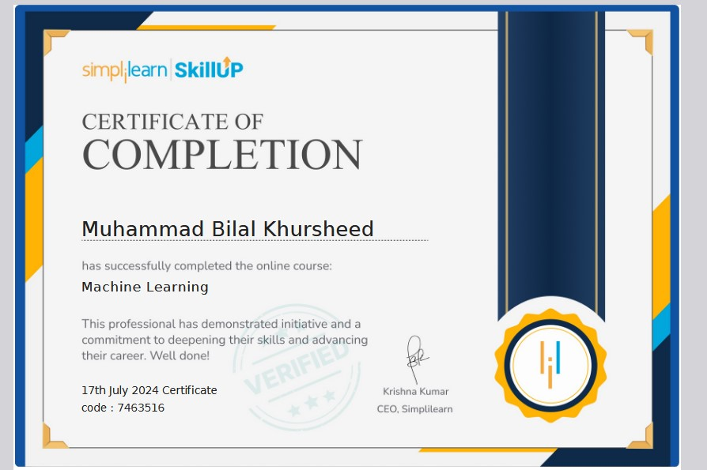
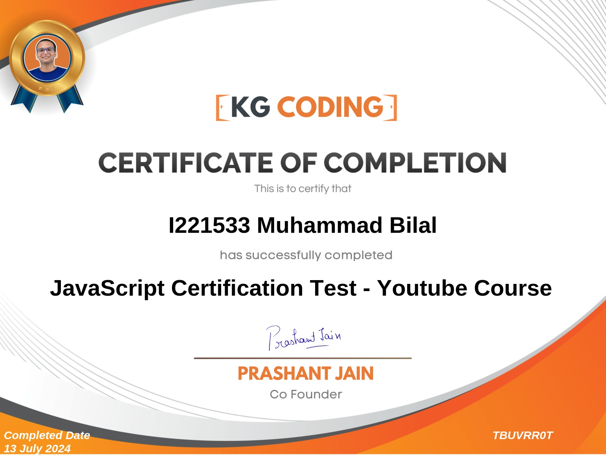
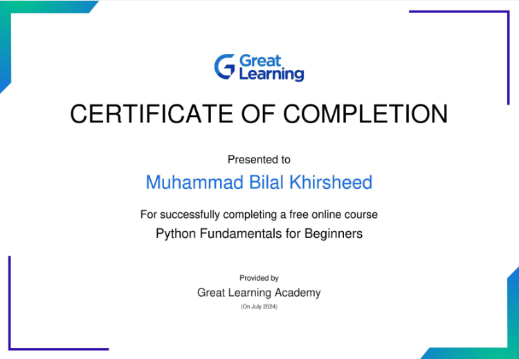

# Hi, I'm Bilal Khurshid 👋  

### Full-Stack Developer & AI Automation Engineer  

I build scalable web applications, intelligent AI-powered systems, and workflow automations that help businesses streamline operations and improve productivity.  

My primary focus is on:  

- Full-Stack Web Development (MERN & Python Ecosystem)  
- AI Automations & Workflow Integrations  
- AI-Powered Applications & RAG Systems  
- Backend APIs, Scraping & System Integrations  

  

---

# 🚀 Core Expertise

## 💻 Full-Stack Development

- React.js  
- Next.js  
- Node.js  
- Express.js  
- Django  
- REST APIs  
- Tailwind CSS  
- MongoDB  
- PostgreSQL  
- MySQL  

---

## 🤖 AI & Automation

- Make.com  
- n8n  
- Zapier  
- AI Workflow Automation  
- CRM & API Integrations  
- Web Scraping & Data Automation  
- Selenium  
- Playwright  
- BeautifulSoup  
- Scrapy  

---

## 🧠 AI Engineering

- Machine Learning  
- Deep Learning  
- TensorFlow  
- PyTorch  
- Scikit-learn  
- RAG (Retrieval-Augmented Generation)  
- LLM Integrations  
- AI Model Fine-Tuning  
- NLP Applications  
- AI Chatbots & Assistants  

---

# 🛠️ Tech Stack

### Languages

### Frontend & Backend

### AI & Automation

### Databases & Cloud

---

# 🧪 Development & Testing Tools

- Git & GitHub  
- Postman  
- Thunder Client  
- VS Code  
- Docker  
- CI/CD Basics  
- API Testing  
- Debugging & Performance Optimization  

---

# 💼 What I Build

✅ Full-Stack Web Applications  
✅ AI-Powered SaaS Platforms  
✅ AI Automations & Business Workflows  
✅ CRM & API Integrations  
✅ RAG-Based AI Systems  
✅ Custom Dashboards & Admin Panels  
✅ Scraping & Data Automation Systems  

---

# 🎓 Certifications

### Machine Learning – Simplilearn

  

### JavaScript – KG CODING

  

### Machine Learning & AI – Google Cloud

  

### Python – Great Learning

  

---

# 📫 Connect With Me

- LinkedIn  
- GitHub  
- Fiverr  
- Upwork  

---

  <b>Building scalable software, intelligent AI systems, and powerful automations.</b>

